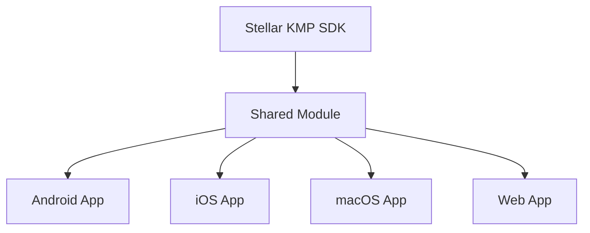

# Sample Applications Guide

This guide explores the sample applications included with the Stellar KMP SDK, demonstrating best practices for Kotlin Multiplatform development.

## Table of Contents

- [Overview](#overview)
- [Architecture](#architecture)
- [Shared Module](#shared-module)
- [Android App](#android-app)
- [iOS App](#ios-app)
- [macOS App](#macos-app)
- [Web App](#web-app)
- [Running the Samples](#running-the-samples)
- [Code Walkthrough](#code-walkthrough)
- [Best Practices Demonstrated](#best-practices-demonstrated)
- [Extending the Samples](#extending-the-samples)

## Overview

The `stellarSample` directory contains a complete Kotlin Multiplatform application that demonstrates:

- **Shared business logic** written once in Kotlin
- **Platform-specific UIs** for Android, iOS, macOS, and Web
- **Real SDK usage** with KeyPair generation, signing, and verification
- **Proper KMP architecture** with clear separation of concerns

### What Makes This Special?

```
Traditional Development:
- Android: 2000 lines (logic + UI)
- iOS: 2000 lines (logic + UI)
- Web: 2000 lines (logic + UI)
- Total: 6000 lines with duplicated logic

KMP Development:
- Shared: 500 lines (logic)
- Android UI: 200 lines
- iOS UI: 200 lines
- Web UI: 200 lines
- Total: 1100 lines, no duplication
```

## Architecture

### Project Structure

```
stellarSample/
├── shared/                     # Shared Kotlin module
│   ├── build.gradle.kts       # Multiplatform configuration
│   └── src/
│       ├── commonMain/        # Shared business logic
│       │   └── kotlin/
│       │       ├── StellarDemo.kt
│       │       └── Models.kt
│       ├── commonTest/        # Shared tests
│       │   └── kotlin/
│       │       └── StellarDemoTest.kt
│       ├── androidMain/       # Android-specific code
│       ├── iosMain/          # iOS-specific code
│       └── jsMain/           # JavaScript-specific code
│
├── androidApp/                # Android application
│   ├── build.gradle.kts
│   └── src/main/
│       ├── AndroidManifest.xml
│       └── kotlin/
│           ├── MainActivity.kt
│           └── StellarViewModel.kt
│
├── iosApp/                    # iOS application
│   ├── project.yml           # XcodeGen configuration
│   ├── StellarSample/
│   │   ├── ContentView.swift
│   │   ├── StellarViewModel.swift
│   │   └── StellarSampleApp.swift
│   └── StellarSample.xcodeproj
│
├── macosApp/                  # macOS application
│   ├── project.yml
│   └── StellarSampleMac/
│       └── ContentView.swift
│
└── webApp/                    # Web application
    ├── build.gradle.kts
    └── src/jsMain/
        ├── kotlin/Main.kt
        └── resources/index.html
```

### Dependency Flow



## Shared Module

### StellarDemo.kt

The core business logic shared across all platforms:

```kotlin
// shared/src/commonMain/kotlin/StellarDemo.kt
package com.stellar.sample

import com.soneso.stellar.sdk.KeyPair
import kotlinx.coroutines.runBlocking

class StellarDemo {

    // Stored keypair for demonstrations
    private var currentKeypair: KeyPair? = null
    private var lastSignature: SignatureResult? = null

    /**
     * Generate a random keypair and return its info
     */
    fun generateRandomKeyPair(): KeyPairInfo = runBlocking {
        val keypair = KeyPair.random()
        currentKeypair = keypair

        KeyPairInfo(
            accountId = keypair.getAccountId(),
            secretSeed = keypair.getSecretSeed()?.concatToString(),
            canSign = keypair.canSign(),
            cryptoLibrary = KeyPair.getCryptoLibraryName()
        )
    }

    /**
     * Create keypair from secret seed
     */
    fun createFromSeed(seed: String): Result<KeyPairInfo> = runBlocking {
        try {
            val keypair = KeyPair.fromSecretSeed(seed)
            currentKeypair = keypair

            Result.success(
                KeyPairInfo(
                    accountId = keypair.getAccountId(),
                    secretSeed = seed,
                    canSign = keypair.canSign(),
                    cryptoLibrary = KeyPair.getCryptoLibraryName()
                )
            )
        } catch (e: Exception) {
            Result.failure(e)
        }
    }

    /**
     * Create public-only keypair from account ID
     */
    fun createFromAccountId(accountId: String): Result<KeyPairInfo> {
        return try {
            val keypair = KeyPair.fromAccountId(accountId)
            currentKeypair = keypair

            Result.success(
                KeyPairInfo(
                    accountId = keypair.getAccountId(),
                    secretSeed = null,
                    canSign = keypair.canSign(),
                    cryptoLibrary = KeyPair.getCryptoLibraryName()
                )
            )
        } catch (e: Exception) {
            Result.failure(e)
        }
    }

    /**
     * Sign a message with current keypair
     */
    fun signMessage(message: String): Result<SignatureResult> = runBlocking {
        val keypair = currentKeypair ?: return@runBlocking Result.failure(
            IllegalStateException("No keypair available")
        )

        if (!keypair.canSign()) {
            return@runBlocking Result.failure(
                IllegalStateException("Keypair cannot sign")
            )
        }

        try {
            val data = message.encodeToByteArray()
            val signature = keypair.sign(data)

            val result = SignatureResult(
                message = message,
                signature = signature.toHexString(),
                accountId = keypair.getAccountId()
            )
            lastSignature = result

            Result.success(result)
        } catch (e: Exception) {
            Result.failure(e)
        }
    }

    /**
     * Verify the last signature
     */
    fun verifySignature(signatureResult: SignatureResult): Result<Boolean> = runBlocking {
        val keypair = currentKeypair ?: return@runBlocking Result.failure(
            IllegalStateException("No keypair available")
        )

        try {
            val data = signatureResult.message.encodeToByteArray()
            val signature = signatureResult.signature.hexToByteArray()

            val isValid = keypair.verify(data, signature)
            Result.success(isValid)
        } catch (e: Exception) {
            Result.failure(e)
        }
    }

    /**
     * Run comprehensive test suite
     */
    fun runTestSuite(): List<TestResult> {
        val results = mutableListOf<TestResult>()

        // Test 1: Random keypair generation
        results.add(testRandomGeneration())

        // Test 2: Import from seed
        results.add(testImportFromSeed())

        // Test 3: Public-only keypair
        results.add(testPublicOnlyKeypair())

        // Test 4: Sign and verify
        results.add(testSignAndVerify())

        // Test 5: Invalid seed handling
        results.add(testInvalidSeed())

        // Test 6: Cross-verification
        results.add(testCrossVerification())

        // Test 7: Crypto library detection
        results.add(testCryptoLibrary())

        // Test 8: Performance test
        results.add(testPerformance())

        return results
    }

    private fun testRandomGeneration(): TestResult {
        return try {
            val keypair = generateRandomKeyPair()
            TestResult(
                name = "Random Generation",
                passed = keypair.accountId.startsWith("G") &&
                        keypair.secretSeed?.startsWith("S") == true &&
                        keypair.canSign,
                details = "Generated: ${keypair.accountId}"
            )
        } catch (e: Exception) {
            TestResult("Random Generation", false, e.message ?: "Failed")
        }
    }

    // ... more test implementations
}

// Data models
data class KeyPairInfo(
    val accountId: String,
    val secretSeed: String?,
    val canSign: Boolean,
    val cryptoLibrary: String
)

data class SignatureResult(
    val message: String,
    val signature: String,
    val accountId: String
)

data class TestResult(
    val name: String,
    val passed: Boolean,
    val details: String
)

// Extension functions
fun ByteArray.toHexString(): String =
    joinToString("") { "%02x".format(it) }

fun String.hexToByteArray(): ByteArray =
    chunked(2).map { it.toInt(16).toByte() }.toByteArray()
```

### Shared Tests

```kotlin
// shared/src/commonTest/kotlin/StellarDemoTest.kt
import kotlin.test.Test
import kotlin.test.assertTrue
import kotlin.test.assertNotNull
import kotlin.test.assertEquals

class StellarDemoTest {

    @Test
    fun testRandomKeypairGeneration() {
        val demo = StellarDemo()
        val keypair = demo.generateRandomKeyPair()

        assertTrue(keypair.accountId.startsWith("G"))
        assertNotNull(keypair.secretSeed)
        assertTrue(keypair.secretSeed!!.startsWith("S"))
        assertTrue(keypair.canSign)
    }

    @Test
    fun testSignAndVerify() {
        val demo = StellarDemo()

        // Generate keypair
        demo.generateRandomKeyPair()

        // Sign message
        val signResult = demo.signMessage("Hello Stellar!")
        assertTrue(signResult.isSuccess)

        // Verify signature
        val verifyResult = demo.verifySignature(signResult.getOrThrow())
        assertTrue(verifyResult.isSuccess)
        assertTrue(verifyResult.getOrThrow())
    }

    @Test
    fun testImportFromSeed() {
        val demo = StellarDemo()
        val seed = "SDJHRQF4GCMIIKAAAQ6IHY42X73FQFLHUULAPSKKD4DFDM7UXWWCRHBE"

        val result = demo.createFromSeed(seed)
        assertTrue(result.isSuccess)

        val keypair = result.getOrThrow()
        assertEquals(
            "GCZHXL5HXQX5ABDM26LHYRCQZ5OJFHLOPLZX47WEBP3V2PF5AVFK2A5D",
            keypair.accountId
        )
    }

    @Test
    fun testPlatformCompatibility() = runTest {
        // This test verifies the SDK works on current platform
        val keypair = KeyPair.random()
        assertNotNull(keypair)

        val message = "Test".encodeToByteArray()
        val signature = keypair.sign(message)
        assertTrue(keypair.verify(message, signature))
    }
}
```

## Android App

### MainActivity.kt

```kotlin
// androidApp/src/main/kotlin/MainActivity.kt
package com.stellar.sample.android

import android.os.Bundle
import androidx.activity.ComponentActivity
import androidx.activity.compose.setContent
import androidx.compose.foundation.layout.*
import androidx.compose.material3.*
import androidx.compose.runtime.*
import androidx.compose.ui.Modifier
import androidx.compose.ui.unit.dp
import androidx.lifecycle.viewmodel.compose.viewModel

class MainActivity : ComponentActivity() {
    override fun onCreate(savedInstanceState: Bundle?) {
        super.onCreate(savedInstanceState)
        setContent {
            StellarSampleTheme {
                Surface(
                    modifier = Modifier.fillMaxSize(),
                    color = MaterialTheme.colorScheme.background
                ) {
                    StellarApp()
                }
            }
        }
    }
}

@OptIn(ExperimentalMaterial3Api::class)
@Composable
fun StellarApp(viewModel: StellarViewModel = viewModel()) {
    val keypairInfo by viewModel.keypairInfo.collectAsState()
    val signatureResult by viewModel.signatureResult.collectAsState()
    val testResults by viewModel.testResults.collectAsState()
    var selectedTab by remember { mutableStateOf(0) }

    Scaffold(
        topBar = {
            TopAppBar(
                title = { Text("Stellar KMP Sample") }
            )
        }
    ) { paddingValues ->
        Column(
            modifier = Modifier
                .padding(paddingValues)
                .padding(16.dp)
        ) {
            TabRow(selectedTabIndex = selectedTab) {
                Tab(
                    selected = selectedTab == 0,
                    onClick = { selectedTab = 0 },
                    text = { Text("KeyPair") }
                )
                Tab(
                    selected = selectedTab == 1,
                    onClick = { selectedTab = 1 },
                    text = { Text("Sign/Verify") }
                )
                Tab(
                    selected = selectedTab == 2,
                    onClick = { selectedTab = 2 },
                    text = { Text("Tests") }
                )
            }

            Spacer(modifier = Modifier.height(16.dp))

            when (selectedTab) {
                0 -> KeyPairTab(keypairInfo, viewModel)
                1 -> SignVerifyTab(signatureResult, viewModel)
                2 -> TestsTab(testResults, viewModel)
            }
        }
    }
}

@Composable
fun KeyPairTab(
    keypairInfo: KeyPairInfo?,
    viewModel: StellarViewModel
) {
    Column(modifier = Modifier.fillMaxWidth()) {
        Button(
            onClick = { viewModel.generateRandom() },
            modifier = Modifier.fillMaxWidth()
        ) {
            Text("Generate Random KeyPair")
        }

        Spacer(modifier = Modifier.height(8.dp))

        OutlinedTextField(
            value = viewModel.seedInput,
            onValueChange = { viewModel.seedInput = it },
            label = { Text("Secret Seed") },
            modifier = Modifier.fillMaxWidth()
        )

        Button(
            onClick = { viewModel.importFromSeed() },
            modifier = Modifier.fillMaxWidth()
        ) {
            Text("Import from Seed")
        }

        keypairInfo?.let { info ->
            Card(
                modifier = Modifier
                    .fillMaxWidth()
                    .padding(top = 16.dp)
            ) {
                Column(modifier = Modifier.padding(16.dp)) {
                    Text(
                        text = "Account ID:",
                        style = MaterialTheme.typography.labelMedium
                    )
                    Text(
                        text = info.accountId,
                        style = MaterialTheme.typography.bodySmall
                    )

                    Spacer(modifier = Modifier.height(8.dp))

                    info.secretSeed?.let { seed ->
                        Text(
                            text = "Secret Seed:",
                            style = MaterialTheme.typography.labelMedium
                        )
                        Text(
                            text = seed,
                            style = MaterialTheme.typography.bodySmall
                        )
                    }

                    Spacer(modifier = Modifier.height(8.dp))

                    Row {
                        Text("Can Sign: ")
                        Text(
                            text = if (info.canSign) "✅" else "❌",
                            color = if (info.canSign)
                                MaterialTheme.colorScheme.primary
                            else
                                MaterialTheme.colorScheme.error
                        )
                    }

                    Text("Crypto: ${info.cryptoLibrary}")
                }
            }
        }
    }
}
```

### StellarViewModel.kt

```kotlin
// androidApp/src/main/kotlin/StellarViewModel.kt
package com.stellar.sample.android

import androidx.compose.runtime.*
import androidx.lifecycle.ViewModel
import androidx.lifecycle.viewModelScope
import com.stellar.sample.StellarDemo
import com.stellar.sample.KeyPairInfo
import com.stellar.sample.SignatureResult
import com.stellar.sample.TestResult
import kotlinx.coroutines.flow.MutableStateFlow
import kotlinx.coroutines.flow.StateFlow
import kotlinx.coroutines.launch

class StellarViewModel : ViewModel() {
    private val stellarDemo = StellarDemo()

    private val _keypairInfo = MutableStateFlow<KeyPairInfo?>(null)
    val keypairInfo: StateFlow<KeyPairInfo?> = _keypairInfo

    private val _signatureResult = MutableStateFlow<SignatureResult?>(null)
    val signatureResult: StateFlow<SignatureResult?> = _signatureResult

    private val _testResults = MutableStateFlow<List<TestResult>>(emptyList())
    val testResults: StateFlow<List<TestResult>> = _testResults

    var seedInput by mutableStateOf("")
    var messageInput by mutableStateOf("Hello Stellar!")

    fun generateRandom() {
        viewModelScope.launch {
            _keypairInfo.value = stellarDemo.generateRandomKeyPair()
        }
    }

    fun importFromSeed() {
        viewModelScope.launch {
            val result = stellarDemo.createFromSeed(seedInput)
            result.onSuccess { _keypairInfo.value = it }
            result.onFailure { /* Handle error */ }
        }
    }

    fun signMessage() {
        viewModelScope.launch {
            val result = stellarDemo.signMessage(messageInput)
            result.onSuccess { _signatureResult.value = it }
        }
    }

    fun verifySignature() {
        viewModelScope.launch {
            _signatureResult.value?.let { sig ->
                val result = stellarDemo.verifySignature(sig)
                // Update UI with verification result
            }
        }
    }

    fun runTests() {
        viewModelScope.launch {
            _testResults.value = stellarDemo.runTestSuite()
        }
    }
}
```

## iOS App

### ContentView.swift

```swift
// iosApp/StellarSample/ContentView.swift
import SwiftUI
import shared

struct ContentView: View {
    @StateObject private var viewModel = StellarViewModel()

    var body: some View {
        TabView {
            KeyPairView(viewModel: viewModel)
                .tabItem {
                    Label("KeyPair", systemImage: "key")
                }

            SignVerifyView(viewModel: viewModel)
                .tabItem {
                    Label("Sign/Verify", systemImage: "signature")
                }

            TestsView(viewModel: viewModel)
                .tabItem {
                    Label("Tests", systemImage: "checkmark.circle")
                }
        }
    }
}

struct KeyPairView: View {
    @ObservedObject var viewModel: StellarViewModel
    @State private var seedInput = ""

    var body: some View {
        NavigationView {
            ScrollView {
                VStack(spacing: 20) {
                    Button(action: {
                        viewModel.generateRandom()
                    }) {
                        Text("Generate Random KeyPair")
                            .frame(maxWidth: .infinity)
                    }
                    .buttonStyle(.borderedProminent)

                    VStack(alignment: .leading) {
                        Text("Import from Seed")
                            .font(.headline)

                        TextField("Secret Seed (S...)", text: $seedInput)
                            .textFieldStyle(.roundedBorder)

                        Button(action: {
                            viewModel.importFromSeed(seedInput)
                        }) {
                            Text("Import")
                                .frame(maxWidth: .infinity)
                        }
                        .buttonStyle(.bordered)
                    }

                    if let keypair = viewModel.keypairInfo {
                        KeyPairInfoView(keypair: keypair)
                    }
                }
                .padding()
            }
            .navigationTitle("Stellar KMP Sample")
        }
    }
}

struct KeyPairInfoView: View {
    let keypair: KeyPairInfo

    var body: some View {
        VStack(alignment: .leading, spacing: 12) {
            GroupBox("Account Information") {
                VStack(alignment: .leading, spacing: 8) {
                    Label("Account ID", systemImage: "person.circle")
                        .font(.caption)
                        .foregroundColor(.secondary)

                    Text(keypair.accountId)
                        .font(.system(.caption, design: .monospaced))
                        .textSelection(.enabled)

                    if let seed = keypair.secretSeed {
                        Divider()

                        Label("Secret Seed", systemImage: "lock")
                            .font(.caption)
                            .foregroundColor(.secondary)

                        Text(seed)
                            .font(.system(.caption, design: .monospaced))
                            .textSelection(.enabled)
                    }

                    Divider()

                    HStack {
                        Text("Can Sign:")
                        Text(keypair.canSign ? "✅ Yes" : "❌ No")
                            .foregroundColor(keypair.canSign ? .green : .red)
                    }

                    HStack {
                        Text("Crypto Library:")
                        Text(keypair.cryptoLibrary)
                            .font(.system(.body, design: .monospaced))
                    }
                }
                .frame(maxWidth: .infinity, alignment: .leading)
            }
        }
    }
}

struct SignVerifyView: View {
    @ObservedObject var viewModel: StellarViewModel
    @State private var message = "Hello Stellar!"

    var body: some View {
        NavigationView {
            ScrollView {
                VStack(spacing: 20) {
                    GroupBox("Message") {
                        TextField("Enter message", text: $message)
                            .textFieldStyle(.roundedBorder)
                    }

                    Button(action: {
                        viewModel.signMessage(message)
                    }) {
                        Label("Sign Message", systemImage: "signature")
                            .frame(maxWidth: .infinity)
                    }
                    .buttonStyle(.borderedProminent)
                    .disabled(viewModel.keypairInfo == nil)

                    if let signature = viewModel.signatureResult {
                        GroupBox("Signature") {
                            VStack(alignment: .leading, spacing: 8) {
                                Text("Message: \(signature.message)")
                                Text("Signature:")
                                    .font(.caption)
                                Text(signature.signature)
                                    .font(.system(.caption, design: .monospaced))
                                    .lineLimit(3)

                                Button(action: {
                                    viewModel.verifySignature()
                                }) {
                                    Label("Verify", systemImage: "checkmark.shield")
                                        .frame(maxWidth: .infinity)
                                }
                                .buttonStyle(.bordered)

                                if let isValid = viewModel.verificationResult {
                                    HStack {
                                        Image(systemName: isValid ? "checkmark.circle.fill" : "xmark.circle.fill")
                                            .foregroundColor(isValid ? .green : .red)
                                        Text(isValid ? "Valid Signature" : "Invalid Signature")
                                    }
                                }
                            }
                        }
                    }
                }
                .padding()
            }
            .navigationTitle("Sign & Verify")
        }
    }
}

struct TestsView: View {
    @ObservedObject var viewModel: StellarViewModel

    var body: some View {
        NavigationView {
            VStack {
                Button(action: {
                    viewModel.runTests()
                }) {
                    Label("Run Test Suite", systemImage: "play.circle")
                        .frame(maxWidth: .infinity)
                }
                .buttonStyle(.borderedProminent)
                .padding()

                if !viewModel.testResults.isEmpty {
                    List(viewModel.testResults) { result in
                        HStack {
                            Image(systemName: result.passed ? "checkmark.circle.fill" : "xmark.circle.fill")
                                .foregroundColor(result.passed ? .green : .red)

                            VStack(alignment: .leading) {
                                Text(result.name)
                                    .font(.headline)
                                Text(result.details)
                                    .font(.caption)
                                    .foregroundColor(.secondary)
                            }

                            Spacer()
                        }
                    }
                }

                Spacer()
            }
            .navigationTitle("Tests")
        }
    }
}
```

### StellarViewModel.swift

```swift
// iosApp/StellarSample/StellarViewModel.swift
import SwiftUI
import shared

class StellarViewModel: ObservableObject {
    private let stellarDemo = StellarDemo()

    @Published var keypairInfo: KeyPairInfo?
    @Published var signatureResult: SignatureResult?
    @Published var verificationResult: Bool?
    @Published var testResults: [TestResult] = []

    func generateRandom() {
        keypairInfo = stellarDemo.generateRandomKeyPair()
    }

    func importFromSeed(_ seed: String) {
        let result = stellarDemo.createFromSeed(seed: seed)
        if result.isSuccess {
            keypairInfo = try? result.get()
        }
    }

    func signMessage(_ message: String) {
        let result = stellarDemo.signMessage(message: message)
        if result.isSuccess {
            signatureResult = try? result.get()
        }
    }

    func verifySignature() {
        guard let signature = signatureResult else { return }

        let result = stellarDemo.verifySignature(signatureResult: signature)
        if result.isSuccess {
            verificationResult = try? result.get()
        }
    }

    func runTests() {
        testResults = stellarDemo.runTestSuite()
    }
}
```

## Web App

### Main.kt

```kotlin
// webApp/src/jsMain/kotlin/Main.kt
import com.stellar.sample.StellarDemo
import kotlinx.browser.document
import kotlinx.browser.window
import kotlinx.coroutines.MainScope
import kotlinx.coroutines.launch
import kotlinx.html.dom.append
import kotlinx.html.js.*
import org.w3c.dom.HTMLButtonElement
import org.w3c.dom.HTMLDivElement
import org.w3c.dom.HTMLInputElement

private val scope = MainScope()
private val stellarDemo = StellarDemo()

fun main() {
    window.onload = {
        setupUI()
    }
}

fun setupUI() {
    val container = document.getElementById("app") as HTMLDivElement

    container.append {
        div("container") {
            h1 { +"Stellar KMP Web Sample" }

            div("section") {
                h2 { +"KeyPair Generation" }

                button {
                    id = "generateBtn"
                    +"Generate Random KeyPair"
                }

                div {
                    id = "keypairInfo"
                    classes = setOf("info-box")
                }
            }

            div("section") {
                h2 { +"Import from Seed" }

                input {
                    id = "seedInput"
                    type = InputType.text
                    placeholder = "Enter secret seed (S...)"
                }

                button {
                    id = "importBtn"
                    +"Import"
                }
            }

            div("section") {
                h2 { +"Sign & Verify" }

                input {
                    id = "messageInput"
                    type = InputType.text
                    value = "Hello Stellar!"
                }

                button {
                    id = "signBtn"
                    +"Sign Message"
                }

                div {
                    id = "signatureInfo"
                    classes = setOf("info-box")
                }

                button {
                    id = "verifyBtn"
                    +"Verify Signature"
                    style = "display: none;"
                }

                div {
                    id = "verifyResult"
                }
            }

            div("section") {
                h2 { +"Test Suite" }

                button {
                    id = "runTestsBtn"
                    +"Run All Tests"
                }

                div {
                    id = "testResults"
                }
            }
        }
    }

    setupEventHandlers()
}

fun setupEventHandlers() {
    // Generate random keypair
    val generateBtn = document.getElementById("generateBtn") as HTMLButtonElement
    generateBtn.onclick = {
        scope.launch {
            val keypair = stellarDemo.generateRandomKeyPair()
            displayKeypair(keypair)
        }
    }

    // Import from seed
    val importBtn = document.getElementById("importBtn") as HTMLButtonElement
    importBtn.onclick = {
        val seedInput = document.getElementById("seedInput") as HTMLInputElement
        val seed = seedInput.value

        scope.launch {
            val result = stellarDemo.createFromSeed(seed)
            result.onSuccess { keypair ->
                displayKeypair(keypair)
            }
            result.onFailure { error ->
                showError("Import failed: ${error.message}")
            }
        }
    }

    // Sign message
    val signBtn = document.getElementById("signBtn") as HTMLButtonElement
    signBtn.onclick = {
        val messageInput = document.getElementById("messageInput") as HTMLInputElement
        val message = messageInput.value

        scope.launch {
            val result = stellarDemo.signMessage(message)
            result.onSuccess { signature ->
                displaySignature(signature)
            }
            result.onFailure { error ->
                showError("Signing failed: ${error.message}")
            }
        }
    }

    // Verify signature
    val verifyBtn = document.getElementById("verifyBtn") as HTMLButtonElement
    verifyBtn.onclick = {
        scope.launch {
            // Verify using stored signature
            // Implementation...
        }
    }

    // Run tests
    val runTestsBtn = document.getElementById("runTestsBtn") as HTMLButtonElement
    runTestsBtn.onclick = {
        scope.launch {
            val results = stellarDemo.runTestSuite()
            displayTestResults(results)
        }
    }
}

fun displayKeypair(keypair: KeyPairInfo) {
    val infoDiv = document.getElementById("keypairInfo") as HTMLDivElement
    infoDiv.innerHTML = """
        <h3>KeyPair Generated</h3>
        <p><strong>Account ID:</strong><br/>${keypair.accountId}</p>
        ${keypair.secretSeed?.let {
            "<p><strong>Secret Seed:</strong><br/>$it</p>"
        } ?: ""}
        <p><strong>Can Sign:</strong> ${if (keypair.canSign) "✅" else "❌"}</p>
        <p><strong>Crypto Library:</strong> ${keypair.cryptoLibrary}</p>
    """.trimIndent()
}

fun displaySignature(signature: SignatureResult) {
    val infoDiv = document.getElementById("signatureInfo") as HTMLDivElement
    infoDiv.innerHTML = """
        <h3>Signature Created</h3>
        <p><strong>Message:</strong> ${signature.message}</p>
        <p><strong>Signature:</strong><br/>
           <code>${signature.signature.take(64)}...</code>
        </p>
        <p><strong>Signer:</strong><br/>${signature.accountId}</p>
    """.trimIndent()

    // Show verify button
    val verifyBtn = document.getElementById("verifyBtn") as HTMLButtonElement
    verifyBtn.style.display = "block"
}

fun displayTestResults(results: List<TestResult>) {
    val resultsDiv = document.getElementById("testResults") as HTMLDivElement
    resultsDiv.innerHTML = "<h3>Test Results</h3>"

    results.forEach { result ->
        val icon = if (result.passed) "✅" else "❌"
        val color = if (result.passed) "green" else "red"

        resultsDiv.append {
            div {
                style = "margin: 10px 0; padding: 10px; border-left: 3px solid $color;"
                +"$icon ${result.name}"
                br
                small {
                    style = "color: gray;"
                    +result.details
                }
            }
        }
    }

    // Summary
    val passed = results.count { it.passed }
    val total = results.size
    resultsDiv.append {
        div {
            style = "margin-top: 20px; font-weight: bold;"
            +"Results: $passed/$total tests passed"
        }
    }
}

fun showError(message: String) {
    window.alert(message)
}
```

### index.html

```html
<!DOCTYPE html>
<html lang="en">
<head>
    <meta charset="UTF-8">
    <meta name="viewport" content="width=device-width, initial-scale=1.0">
    <title>Stellar KMP Web Sample</title>
    <style>
        body {
            font-family: -apple-system, BlinkMacSystemFont, "Segoe UI", Roboto, sans-serif;
            max-width: 800px;
            margin: 0 auto;
            padding: 20px;
            background: #f5f5f5;
        }

        .container {
            background: white;
            border-radius: 8px;
            padding: 30px;
            box-shadow: 0 2px 4px rgba(0,0,0,0.1);
        }

        h1 {
            color: #333;
            border-bottom: 2px solid #007AFF;
            padding-bottom: 10px;
        }

        .section {
            margin: 30px 0;
            padding: 20px;
            background: #f9f9f9;
            border-radius: 4px;
        }

        button {
            background: #007AFF;
            color: white;
            border: none;
            padding: 10px 20px;
            border-radius: 4px;
            cursor: pointer;
            margin: 5px 0;
            font-size: 16px;
        }

        button:hover {
            background: #0056b3;
        }

        input {
            width: 100%;
            padding: 8px;
            margin: 5px 0;
            border: 1px solid #ddd;
            border-radius: 4px;
        }

        .info-box {
            margin-top: 15px;
            padding: 15px;
            background: white;
            border: 1px solid #ddd;
            border-radius: 4px;
            word-break: break-all;
        }

        code {
            background: #f4f4f4;
            padding: 2px 4px;
            border-radius: 2px;
            font-family: monospace;
        }
    </style>
</head>
<body>
    <div id="app"></div>
    <script src="webApp.js"></script>
</body>
</html>
```

## Running the Samples

### Android

```bash
# Build and run
./gradlew :stellarSample:androidApp:installDebug

# Or open in Android Studio
# File -> Open -> stellarSample/androidApp
```

### iOS

```bash
# Build framework
./gradlew :stellarSample:shared:linkDebugFrameworkIosSimulatorArm64

# Generate Xcode project
cd stellarSample/iosApp
xcodegen generate

# Open in Xcode
open StellarSample.xcodeproj

# Build and run (Cmd+R)
```

### macOS

```bash
# Install libsodium (for development)
brew install libsodium

# Build framework
./gradlew :stellarSample:shared:linkDebugFrameworkMacosArm64

# Generate and open Xcode project
cd stellarSample/macosApp
xcodegen generate
open StellarSampleMac.xcodeproj
```

### Web

```bash
# Development server with hot reload
./gradlew :stellarSample:webApp:jsBrowserDevelopmentRun

# Open browser to http://localhost:8080

# Production build
./gradlew :stellarSample:webApp:jsBrowserProductionWebpack

# Output in stellarSample/webApp/build/distributions/
```

## Best Practices Demonstrated

### 1. Shared Business Logic

All business logic is in the `shared` module:
- Platform-agnostic code
- Testable independently
- Single source of truth

### 2. Platform-Specific UI

Each platform uses native UI frameworks:
- Android: Jetpack Compose
- iOS: SwiftUI
- Web: HTML/CSS with Kotlin/JS

### 3. Proper Error Handling

```kotlin
// Shared code uses Result type
fun operation(): Result<Data> {
    return try {
        Result.success(performOperation())
    } catch (e: Exception) {
        Result.failure(e)
    }
}

// Platform code handles appropriately
result.onSuccess { data ->
    updateUI(data)
}.onFailure { error ->
    showError(error)
}
```

### 4. Async Operations

```kotlin
// Shared module handles coroutines internally
fun generateRandomKeyPair(): KeyPairInfo = runBlocking {
    KeyPair.random()
    // ...
}

// Platform code stays synchronous (simpler)
val keypair = demo.generateRandomKeyPair()
```

### 5. Testing Strategy

- Shared tests run on all platforms
- Platform-specific tests for UI only
- 100% business logic test coverage

## Extending the Samples

### Adding New Features

1. **Add to Shared Module**:
```kotlin
// shared/src/commonMain/kotlin/StellarDemo.kt
fun sendPayment(recipient: String, amount: String): Result<TransactionResult> {
    // Implementation using SDK
}
```

2. **Update Platform UIs**:
```kotlin
// Android
Button(onClick = { viewModel.sendPayment() }) {
    Text("Send Payment")
}
```

```swift
// iOS
Button("Send Payment") {
    viewModel.sendPayment()
}
```

### Creating Your Own Sample

1. **Copy Structure**:
```bash
cp -r stellarSample myApp
```

2. **Update Gradle**:
```kotlin
// settings.gradle.kts
include(":myApp:shared")
include(":myApp:androidApp")
// ...
```

3. **Modify Shared Logic**:
- Add your business logic
- Keep it platform-agnostic

4. **Create Platform UIs**:
- Use native frameworks
- Keep UI code minimal

---

**Navigation**: [← macOS Platform](platforms/macos.md) | [Testing Guide →](testing.md)